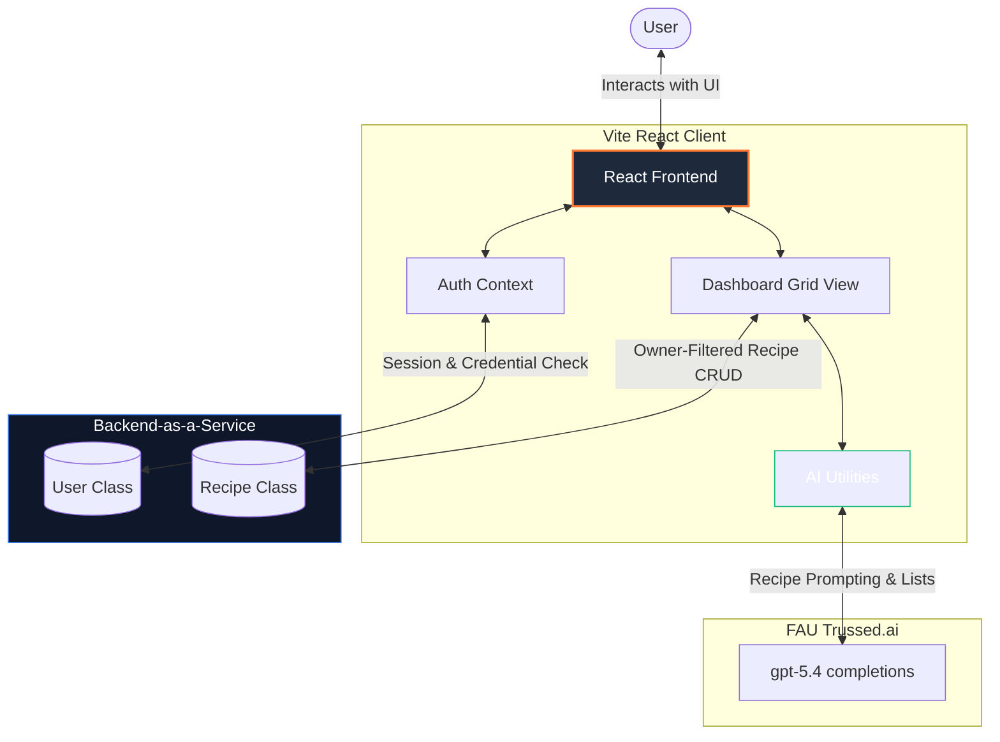

# Architecture

RecipeChef AI uses a modern, client-side React frontend communicating with Back4App (for database/authentication) and Trussed.ai (for AI completions).

## System Flow Diagram

## Frontend

The frontend is built with React and Vite.

Responsibilities:

- Show pages and forms
- Manage login state
- Call Back4App REST API
- Call Trussed.ai AI API
- Display loading and error messages

## Back4App

Back4App is used for:

- User registration
- Login
- Session token storage
- Recipe database

## Trussed.ai

Trussed.ai is used for:

- Recipe generation
- Shopping list generation

## Security Notes

Environment variables are stored in `frontend/.env`.

The `.env` file is ignored by Git and should not be committed.