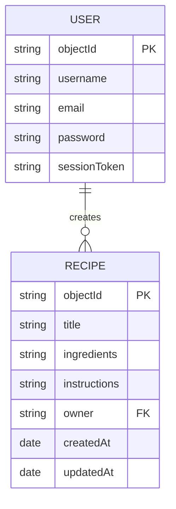

# Database Design

RecipeChef AI uses Back4App as the database and backend-as-a-service.

## Classes

## User

Built-in Back4App `_User` class.

Fields:

| Field | Type | Description |
|---|---|---|
| objectId | String | Unique user id |
| username | String | Login username |
| email | String | User email |
| password | String | Stored securely by Back4App |
| sessionToken | String | User session token |

## Recipe

Custom class: `Recipe`

Fields:

| Field | Type | Description |
|---|---|---|
| objectId | String | Unique recipe id |
| title | String | Recipe title |
| ingredients | String | Recipe ingredients |
| instructions | String | Cooking instructions |
| owner | String | User objectId |
| createdAt | Date | Created timestamp |
| updatedAt | Date | Updated timestamp |

## ERD

One user can create many recipes. Each recipe belongs to one user.